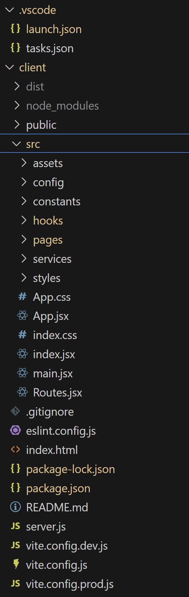
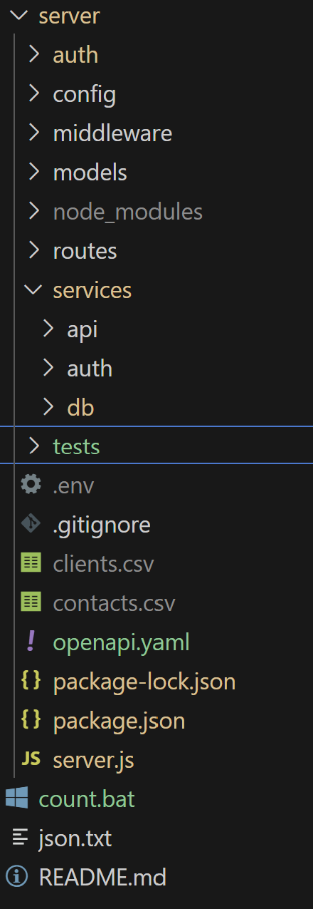

# Project Structure

The VS Code project is full-stack, so it includes both the client and server code.

## Client

### Folders
Here is the directory structure for the client only:

{ width="35%" }

The folder names are mostly self-explanatory, but here is a table that describes what each contains:

| Folder Name | Parent | Description |
|----------|----------|---------|
| .vscode | / | A VS Code-specific file that contains launch.json and tasks.json |
| client | / | The root folder of the front-end code. |
| dist | client | Contains the build files. |
| node_modules | client | This folder is created by the npm install process. All packages are contained here. |
| public | client | Contains static assets (*e.g.* images) |
| src | client | The root folder of the client (front-end) source code. |
| assets | src | Other static assets. |
| config | src | Functions that manage the development vs. production enrivonments. |
| constants | src | Constants mostly related to the QueryBuilder component. |
| hooks | src | Custom React hooks. |
| pages | src | React components that represent web pages. |
| services | src | Express.js client functions that call REST APIs on the server. |
| styles | src | CSS files. |

### Files
Not all files are listed, only ones that require a description:

| File Name | Folder | Description |
|----------|----------|---------|
| .gitignore | client | Contains the file and folders git should ignore. |
| eslint.config.js | client | The ESLint config file. |
| vite.config.js | client | Uses the ```mode``` argument passed in during the vite run call. Values are either ```development``` or ```production```. It uses the value to load either ```vite.config.dev.js``` or ```vite.config.prod.js```. |
| vite.config.dev.js | client | The vite.config.js file for development. |
| vite.config.prod.js | client | The vite.config.js file for production. |

---

## Server

### Folders
Here is the directory structure for the server only:

{ width="30%" }

| Folder Name | Parent | Description |
|----------|----------|---------|
| auth | server | Contains ```zoho.js``` which has the callback function to receive auth tokens from the Zoho API. |
| config | server | Contains configuration json objects. |
| middleware | server | Contains loggin middleware. |
| node_modules | server | This folder is created by the npm install process. All packages are contained here. |
| routes | server | Contains a route for the /api/data endpoint. |
| services | server | Contains service functions for api calls, database connections, and Zoho authorization API calls. |
| api | services | Functions for api calls. |
| auth | services | Functions for Zoho API calls. |
| db | services | Functions for database calls. |
| tests | / | Test scripts written with ```node:test``` and ```Supertest```. |

### Files
Not all files are listed here, only ones that require a description:

| File Name | Folder | Description |
|----------|----------|---------|
| .env | server | Contains environment variables. |
| .gitignore | server | Contains the file and folders git should ignore. |
| server.js | server | The main server code. Contains Express.js REST functions. |
